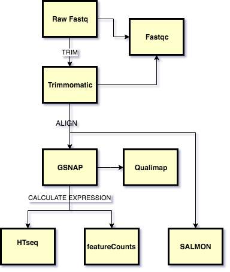

#  RNAseq with GSNAP
## Overview

This tutorial shows how to run a standard predefined RNA-seq analysis on the Brown HPC cluster OSCAR, using the bioflows tool. A visual overview of the workflow is shown below



## Getting Started

### Basic workflow

The workflow consists of the following programs run sequentially on each sample:

-  **Fastqc**: For QC of Raw Fastq reads
-  **Trimmomatic**: Quality and Adapter trimming of raw reads
-  **Fastqc**: Post trimming QC of reads
-  **GSNAP**: alignment of the reads to the reference genome
-  **Samtools**: To process alignments:
   - convert sam to bam
   - remove unmapped reads
   - coordinate sort bam
   - index bam
-  **biobambam Suite** Sort bams (`bamsort` tool)  and mark duplicates (`bammarkduplicates2` tool)
-  **Qualimap** QC of the aligments generated
-  **featureCounts/HTseq** Expression quantification based on counting mapped reads
-  **Salmon**:  Alignment free quantification of known transcripts

Depending on the user's need the workflow can be adapted for just using a subset of steps or the changes in the sequence as long as they are sensible.  We povide a couple of alternative workflows using combinations of the steps in the  basic workflow

### Steps 

The basic steps to running a workflow are:

1. [Create a control file](#Create the YAML file)
2. Create your working directory if does not exist, here we assume it is `/users/mydir`.
3. [Setup a screen session](#/docs/tutorials/Setup_bioflows_env/#Setup GNU screen session)

The next section provide a short how-to with all the commands to execute the test workflow on Brown University's OSCAR HPCcluster. Once you have the test case working you can implement this on your own data 

!!! note "Prerequisites"
    Make sure you have access to the OSCAR cluster or request one by contacting support@ccv.brown.edu. If you are not comfortable with the Linux environment, you can consult the tutorial [here.](https://compbiocore.github.io/cbc-linux-tutorial/linux_explication/) You should also [set up bioflows.](#/docs/tutorials/Setup_bioflows_env)
    
    !!! danger
        You need to have an priority account on OSACAR to run this with real datasets as the resources for exploratory accounts are not sufficient. 
    

    !!! caution
        The working directory in a real example can end up being quite large: up to a few terabytes. On OSCAR, you would create the working directory in a location such as your `data` folder or the `scratch` folder.


### Running the workflow

#### Create the YAML file

Bioflows uses YAML configuration files to run workflows. A detailed documentation of the YAML file and all the options is shown [here](#/docs/yaml_description.md). For the current example, copy the following code into a text file and save it in `/users/mydir` as `test_run.yaml`.

!!! note
    Edit the parameters in the highlighted lines to change values specific to your username


``` yaml hl_lines="8 13"

bioproject: Project_test_localhost
experiment: rnaseq_pilot
sample_manifest:
  fastq_file: sample_manifest_min.csv
  metadata:
run_parms:
  conda_command: source /gpfs/runtime/cbc_conda/bin/activate_cbc_conda
  work_dir: /users/mydir
  log_dir: logs
  paired_end: True
  local_targets: False
  saga_host: localhost
  ssh_user: ccv username
  saga_scheduler: slurm
  gtf_file: /gpfs/data/cbc/cbcollab/ref_tools/Ensembl_hg_GRCh37_rel87/Homo_sapiens.GRCh37.87.gtf
workflow_sequence:
  - fastqc: default
  - gsnap:
      options:
       -d: Ensembl_Homo_sapiens_GRCh37
       -s: /gpfs/data/cbc/cbcollab/cbc_ref/gmapdb_2017.01.14/Ensembl_Homo_sapiens_GRCh37/Ensembl_Homo_sapiens_GRCh37.maps/Ensembl_Homo_sapiens.GRCh37.87.splicesites.iit
      job_params:
        ncpus: 8
        mem: 40000
        time: 60
  - samtools:
      subcommand: view
      suffix:
        input: ".sam"
        output: ".bam"
      options:
        -Sbh:
      job_params:
        time: 60
  - samtools:
      subcommand: view
      suffix:
        input: ".bam"
        output: ".mapped.bam"
      options:
        -bh:
        -F: "0x4"
      job_params:
        time: 60
  - samtools:
      subcommand: view
      suffix:
        output: ".unmapped.bam"
      options:
        -f: "0x4"
  - bamsort:
      suffix:
        input: ".mapped.bam"
        output: ".srtd.bam"
      options:
        inputthreads=4:
        outputthreads=4:
      job_params:
        ncpus: 4
        mem: 2000
        time: 60      
  - samtools:
      subcommand: sort
      suffix:
        input: ".mapped.bam"
  - samtools:
      subcommand: index
      suffix:
        input: ".srtd.bam"
      job_params:
        time: 20      
  - bammarkduplicates2:
      suffix:
        input: ".srtd.bam"
        output: ".dup.srtd.bam"
      job_params:
        mem: 2000
        time: 60
        ncpus: 4
  - qualimap:
      subcommand: rnaseq
  - htseq-count: default

```

If you haven't done so already, copy the above into a text file and save it in `/users/mydir` as `test_run.yaml`

For this tutorial I have created a small test dataset with 10000 read pairs from human RNAseq data, thats available to all user on OSCAR. It should run within the hour and you should see that all the steps from the workflow have completed.

#### Create the manifest file
We will now create the sample manifest file, which is in `csv` format. You can find more information about sample manifest files [here](#/docs/yaml_description.md). Copy the manifest below into a text file and save it in `/users/mydir` as `sample_manifest_min.csv`

``` bash
samp_1299,/gpfs/data/cbc/rnaseq_test_data/PE_hg/Cb2_1.gz,/gpfs/data/cbc/rnaseq_test_data/PE_hg/Cb2_2.gz
samp_1214,/gpfs/data/cbc/rnaseq_test_data/PE_hg/Cb_1.gz,/gpfs/data/cbc/rnaseq_test_data/PE_hg/Cb_2.gz
```

#### Run the workflow in a screen session
If you haven't already started a screen session in the [setup](#/docs/tutorials/Setup_bioflows_env), start one using the following command:
``` bash
screen -S rnaseq_tutorial
```
In your screen session, run the following commands to setup your conda environment (if you have not done so previously during the [setup](#/docs/tutorials/Setup_bioflows_env) or if you just started a new screen session).

``` bash
source /gpfs/runtime/cbc_conda/bin/activate_cbc_conda
bioflows-run test_run.yaml
```


### Workflow outputs

The `bioflows-gatk` call will automatically generate several directories, which may or may not have any outputs directed to them depending on which analyses have been run in bioflows. These directories include: `sra`, `fastq`, `alignments`, `qc`, `slurm_scripts`, `logs`, `expression`, and `checkpoints`.

For this tutorial you should see the following directories

- `fastq` symlinks to fastq files.
- `alignments` SAM and BAM files from GSNAP alignments.
- `qc` QC reports from fastqc and qualimap.
- `slurm_scripts` Records of the commands sent to slurm.
- `logs` Log files from various bioflows processes (including the standard error and standard out).
- `expression` Expression values from featureCounts/Salmon/htseq depending on whats specified.
- `checkpoints` Contains checkpoint records to confirm that bioflows has progressed through each step of the analysis.

Within each folder you will see files that are annotated by `samplename_program_suffix`. We provide a list of outputs and their contents below
## Alternative workflow YAMLs
These YAML's can be used as templates for alternative workflows using various combinations of programs and sequences from the programs defined in the [Basic workflow](#Basic Workflow)